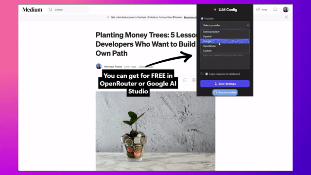

<div id="top">

# QUICK LLM


<em>Instant AI commands on any text — free, provider-agnostic, and no login needed.</em>

[](https://chrome.google.com/webstore/detail/fkgkmfghdnniolojflnpmhdibhnapilp)

[](https://ko-fi.com/I2I31IJ3HP)


<em>Built with:</em>


<br clear="left"/>

</div>

---

## 🔮 Overview

**Quick LLM** is an open-source Chrome extension that brings large language model (LLM) capabilities directly into your browsing experience — no switching tabs, no logging in, no vendor lock-in.  
Highlight text, right-click, and instantly run AI-powered commands like **Check Grammar**, **Summarize**, **Explain**, or your own **Custom Prompt**. The AI’s response appears right on the page in a small popup, keeping you in your flow.

**Key advantages:**

-   **Free & provider-agnostic** — works with any OpenAI-compatible API (Google Gemini, OpenRouter, OpenAI, Mistral, Groq, self-hosted, and more).
-   **No account required** — just plug in your API key from your chosen provider.
-   **Local-only API key storage** — nothing is uploaded to us; your credentials never leave your device.
-   **Open source** — transparent, community-driven, and modifiable.
-   **Distraction-free workflow** — AI results appear inline, without leaving the page.

---

## ❓ Why This Exists

Most AI workflows interrupt your browsing: copy text, switch tabs, paste into a chatbot, wait for a reply, then come back.  
**Quick LLM** exists to remove all that friction.

By integrating AI commands directly into the browser's right-click menu, you can get grammar fixes, summaries, explanations, or custom transformations **without leaving the page**.  
No login walls, no vendor lock-in, no unnecessary accounts — just connect any OpenAI-compatible provider (or your own hosted model) and start using AI instantly.

Because it's **open source**, you can verify exactly how it works, contribute features, or run it entirely with your own infrastructure for maximum privacy.

---

## 💫 Features

|     | Feature                     | Details                                                                                                                                    |
| :-: | :-------------------------- | :----------------------------------------------------------------------------------------------------------------------------------------- |
| 🖱️  | **Right-Click AI Commands** | Run AI tasks directly from the browser context menu. Available actions: Grammar Check, Summarize, Explain, Custom.                         |
| 📝  | **Customizable Prompts**    | Create and save custom prompts for translations, rewrites, tone changes, and more.                                                         |
| 🌐  | **Any Provider, Any Model** | Works with any OpenAI-compatible API (Google, OpenRouter, OpenAI, Mistral, Groq, self-hosted).                                             |
| 🎁  | **Free API Options**        | Get free keys from [Google AI Studio](https://aistudio.google.com) (Gemini) or [OpenRouter](https://openrouter.ai) (multiple free models). |
| 🔒  | **Privacy by Design**       | API keys and settings are stored locally in the browser; nothing is uploaded to our servers.                                               |
| 💡  | **Lightweight UI**          | Small, non-intrusive popup at the bottom-right that auto-closes after 20 seconds.                                                          |

---

## 🌌 Project Structure

```sh
quick-llm-extension/
├── background.js        # Handles context menu clicks & API calls
├── content.js           # Injects popup with AI response
├── manifest.json        # Extension config & permissions
├── popup/
│   ├── popup.html       # Settings UI for provider, endpoint, key, and model
│   └── popup.js         # Saves settings to local storage
├── utils/
│   ├── fetchLLM.js      # Fetch helper with retry logic
│   └── settings.js      # Loads saved settings
└── icons/               # Extension icons & logo
```

---

## ⚡ Getting Started

### 💠 Prerequisites

-   Chrome or Chromium-based browser
-   An API key from any OpenAI-compatible provider (Google, OpenRouter, OpenAI, etc.)

### 🔷 Installation (Developer Mode)

1. Clone the repository:

    ```sh
    git clone https://github.com/htostes/quick-llm-extension
    cd quick-llm-extension
    ```

2. Open Chrome and go to:
    ```
    chrome://extensions/
    ```
3. Enable **Developer mode** (toggle in top right).
4. Click **Load unpacked** and select the project folder.

---

## 🔹 Usage

1. Click the extension icon to open **Settings**.
2. Choose a provider or set a custom endpoint.
3. Enter your API key.
4. Save settings.
5. On any webpage, select text, right-click, choose **Quick LLM**, and pick a command.
6. View the AI’s response in the bottom-right popup.

_Tip: Use the Custom command for translations, rewrites, tone changes, and more._

---

## 🎥 Demo

### First-Time Setup



### Usage


---

## ⭐ License

This project is licensed under the **GPLv3** — see the [LICENSE](LICENSE) file for details.

---

**Quick LLM** — AI where you need it, when you need it.  
No logins. No lock-in. No nonsense.

[Back to top](#top)
